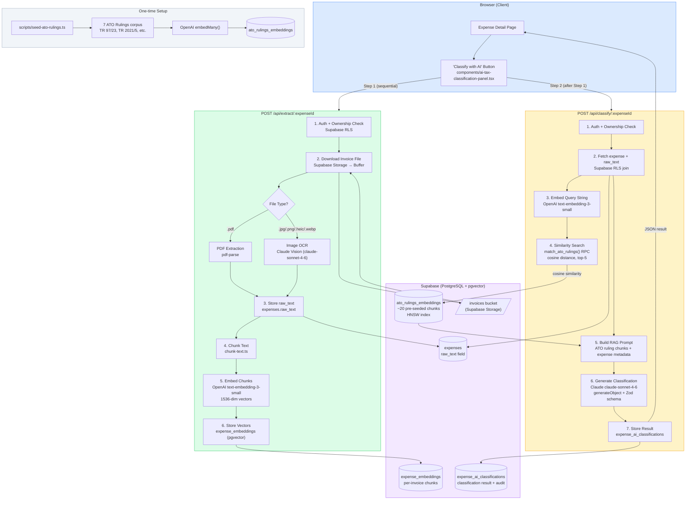

# RAG Tax Classification System

AI-powered Australian ATO tax classification for property investment expenses, built on a Retrieval-Augmented Generation (RAG) pipeline using Next.js, Supabase pgvector, the Vercel AI SDK, and Claude.

---

## End-to-End Architecture Diagram



---

## Step-by-Step Flow

### 0. One-Time Seed: ATO Rulings Knowledge Base

Before the system can classify expenses, it needs a pre-seeded vector database of authoritative ATO rulings to retrieve from.

**Script:** `scripts/seed-ato-rulings.ts`
**Command:** `npm run seed:ato`

| # | Action | Technology |
|---|--------|-----------|
| 0a | Define ruling corpus | 7 ATO rulings hand-curated as structured TypeScript objects |
| 0b | Chunk each ruling body | `lib/ai/chunk-text.ts` — paragraph/sentence-aware splitter, max 900 chars with 100-char overlap |
| 0c | Batch embed all chunks | Vercel AI SDK `embedMany()` → OpenAI `text-embedding-3-small` → 1536-dim float vectors |
| 0d | Upsert into database | `ato_rulings_embeddings` table with HNSW index for fast cosine similarity search |

**ATO Rulings Seeded:**

| Ruling | Subject |
|--------|---------|
| `TR 97/23` | Repairs vs. capital — the foundational ruling. Defines the repair test, initial repairs, and the entirety principle |
| `TR 2021/5` | Division 43 capital works — 2.5%/4% rates, eligible construction expenditure |
| `TR 2020/1` | Division 40 plant & equipment — effective life, depreciation methods, post-2017 restrictions |
| `IT 180` | The Entirety Principle — when replacing a whole asset is capital not a repair |
| `ATO PS LA 2003/8` | Initial repairs — pre-existing defects at acquisition are non-deductible |
| `TD 2023/1` | Instant asset write-off — $20k threshold, eligibility, why it doesn't apply to passive investors |
| `TR 2023/1` | Environmental protection activities — asbestos, lead paint, s 40-755 ITAA 1997 |

> **Further reading:**
> - [ATO: Repairs, maintenance, and capital expenditure](https://www.ato.gov.au/individuals-and-families/investments-and-assets/residential-rental-properties/rental-expenses-you-can-claim/repairs-maintenance-and-capital-expenditure)
> - [Taxation Ruling TR 97/23 (full text)](https://www.ato.gov.au/law/view/document?docid=TXR/TR9723/NAT/ATO/00001)
> - [Division 43 Capital Works — ATO](https://www.ato.gov.au/businesses-and-organisations/income-deductions-and-concessions/depreciation-and-capital-allowances/general-depreciation-rules/capital-works-deductions)

---

### Step 1: Invoice Upload (Existing Flow)

The user fills in the expense form and attaches an invoice file. This is the existing application behaviour — the RAG system consumes the file that is already stored.

**File:** `components/expense-form.tsx`

| # | Action | Technology |
|---|--------|-----------|
| 1a | User selects invoice file | React file input, drag-and-drop |
| 1b | Upload to object storage | Supabase Storage JS client — `storage.from('invoices').upload()` |
| 1c | Store file path in DB | `expenses.invoice_path` (e.g., `{userId}/{renovationId}/{timestamp}.pdf`) |
| 1d | Redirect to expense detail | Next.js `router.push()` — now redirects to the expense detail page so the AI panel is immediately visible |

**Storage path format:** `{user_id}/{renovation_id}/{timestamp}.{ext}`
**Accepted formats:** PDF, JPG, JPEG, PNG, WebP, HEIC

> **Further reading:**
> - [Supabase Storage docs](https://supabase.com/docs/guides/storage)
> - [Supabase Storage access control](https://supabase.com/docs/guides/storage/security/access-control)

---

### Step 2: Text Extraction & Embedding (Extract Route)

**Endpoint:** `POST /api/extract/:expenseId`
**File:** `app/api/extract/[expenseId]/route.ts`
**Target latency:** < 7s (Vercel Hobby 10s limit)

#### 2a. Authentication & Authorisation

```
createClient()  ← uses Supabase SSR cookies (user session)
  → supabase.auth.getUser()            verify JWT
  → supabase.from('expenses').select() enforce RLS ownership
```

The expense is fetched through the user's session client. Supabase Row Level Security (RLS) ensures the query returns `null` if the authenticated user does not own the expense via the property ownership chain (`expenses → renovations → properties → user_id`).

> **Further reading:**
> - [Supabase Row Level Security](https://supabase.com/docs/guides/database/postgres/row-level-security)

#### 2b. File Download from Storage

The file is downloaded server-side using a Supabase service role client (bypasses storage RLS policies that are user-scoped) and converted to a `Buffer`:

```ts
adminSupabase.storage.from('invoices').download(expense.invoice_path)
// → Blob → ArrayBuffer → Buffer
```

#### 2c. Text Extraction

**File:** `lib/ai/extract-text.ts`

Two paths based on MIME type detected from the file extension:

**PDF path — `pdf-parse`:**
```ts
import pdfParse from 'pdf-parse/lib/pdf-parse.js'
const result = await pdfParse(buffer)
// → result.text (string)
```
`pdf-parse` is a pure Node.js wrapper around Mozilla's [PDF.js](https://mozilla.github.io/pdf.js/). It runs entirely server-side with no external API calls. It's imported via the deep path to avoid its self-test file-read at module load time. The `next.config.ts` excludes it from the Next.js bundle via `serverExternalPackages`.

**Image path — Claude Vision:**
```ts
generateText({
  model: anthropic('claude-sonnet-4-6'),
  messages: [{ role: 'user', content: [{ type: 'image', image: dataUrl }, { type: 'text', text: 'Extract all text...' }] }]
})
```
The image buffer is base64-encoded and passed as a data URL to Claude's multimodal API. This produces significantly higher quality OCR than Tesseract for invoice layouts (structured tables, varying fonts, handwriting).

> **Further reading:**
> - [pdf-parse on npm](https://www.npmjs.com/package/pdf-parse)
> - [Vercel AI SDK: generateText](https://sdk.vercel.ai/docs/reference/ai-sdk-core/generate-text)
> - [Anthropic: Vision capabilities](https://docs.anthropic.com/en/docs/build-with-claude/vision)

#### 2d. Text Chunking

**File:** `lib/ai/chunk-text.ts`

The extracted raw text is split into overlapping chunks before embedding. This ensures:
- No single chunk exceeds the embedding model's token limit
- Semantic context is preserved across chunk boundaries via overlap
- Multiple chunks from the same invoice can each independently match ATO rulings

**Strategy:**
1. Split on paragraph breaks (`\n\n`) first
2. If a paragraph exceeds 800 chars, split further at sentence boundaries (`. `)
3. Hard-cut at 800 chars if a single sentence is too long
4. Carry 100 characters of overlap from the previous chunk into the next

For typical invoices (< 2000 chars of text), this produces 1–3 chunks.

> **Further reading:**
> - [Chunking strategies for RAG — Pinecone](https://www.pinecone.io/learn/chunking-strategies/)
> - [Anthropic: Contextual Retrieval](https://www.anthropic.com/research/contextual-retrieval)

#### 2e. Embedding Generation

**File:** `lib/ai/openai-client.ts`

```ts
import { embedMany } from 'ai'
const { embeddings } = await embedMany({
  model: openai.embedding('text-embedding-3-small'),
  values: chunks,  // string[]
})
// embeddings: number[][] — one 1536-dim vector per chunk
```

`text-embedding-3-small` produces 1536-dimensional float vectors. It is OpenAI's most cost-efficient embedding model with strong semantic search performance.

| Model | Dimensions | Cost | Notes |
|-------|-----------|------|-------|
| `text-embedding-3-small` | 1536 | ~$0.02/1M tokens | Used here — good balance |
| `text-embedding-3-large` | 3072 | ~$0.13/1M tokens | Higher accuracy, more expensive |
| `text-embedding-ada-002` | 1536 | ~$0.10/1M tokens | Legacy, worse performance |

> **Further reading:**
> - [OpenAI Embeddings guide](https://platform.openai.com/docs/guides/embeddings)
> - [Vercel AI SDK: embedMany](https://sdk.vercel.ai/docs/reference/ai-sdk-core/embed-many)
> - [text-embedding-3-small announcement](https://openai.com/blog/new-embedding-models-and-api-updates)

#### 2f. Vector Storage

The embeddings are stored in `expense_embeddings` (Supabase PostgreSQL with pgvector), replacing any previous embeddings for this expense (idempotent):

```sql
-- DELETE existing (idempotency)
DELETE FROM expense_embeddings WHERE expense_id = $1;

-- INSERT new chunks
INSERT INTO expense_embeddings (expense_id, chunk_index, chunk_text, embedding)
VALUES ($1, $2, $3, $4::vector(1536));
```

The table has an HNSW index (Hierarchical Navigable Small World) for approximate nearest-neighbour search using cosine distance.

---

### Step 3: RAG Retrieval & Classification (Classify Route)

**Endpoint:** `POST /api/classify/:expenseId`
**File:** `app/api/classify/[expenseId]/route.ts`
**Target latency:** < 8s (Vercel Hobby 10s limit)

#### 3a. Build Query String

A combined query string is constructed from the expense's structured metadata and the first 500 characters of extracted invoice text:

```ts
const queryString = [
  expense.description,
  expense.category,
  expense.supplier,
  expense.raw_text?.slice(0, 500),
].filter(Boolean).join(' ')
```

This query string represents the "question" being asked of the knowledge base: "which ATO rulings are relevant to this expense?"

#### 3b. Query Embedding

The query string is embedded using the same model as the stored chunks, ensuring vectors are in the same semantic space:

```ts
const { embedding: queryEmbedding } = await embed({
  model: embeddingModel,  // text-embedding-3-small
  value: queryString,
})
```

#### 3c. Similarity Search (pgvector)

The query vector is passed to a PostgreSQL function that returns the top-5 most semantically similar ATO ruling chunks:

```ts
supabase.rpc('match_ato_rulings', {
  query_embedding: queryEmbedding,  // number[1536]
  match_count: 5,
  match_threshold: 0.3,            // cosine similarity threshold
})
```

The RPC function uses the `<=>` operator (cosine distance) on the HNSW index:

```sql
1 - (a.embedding <=> query_embedding) as similarity
-- <=> is cosine distance; 1 - distance = cosine similarity
-- Higher similarity = more relevant chunk
```

**Why HNSW over IVFFlat?**

| Index | Recall | Speed | Maintenance |
|-------|--------|-------|-------------|
| HNSW | Higher | Faster at query time | No `REINDEX` needed after inserts |
| IVFFlat | Lower | Slower | Requires `lists` tuning + `REINDEX` |

HNSW is preferred for production workloads with continuous inserts.

> **Further reading:**
> - [pgvector documentation](https://github.com/pgvector/pgvector)
> - [Supabase: pgvector and vector similarity](https://supabase.com/docs/guides/ai/vector-columns)
> - [HNSW vs IVFFlat — Supabase blog](https://supabase.com/blog/increase-performance-pgvector-hnsw)
> - [Cosine similarity explained](https://www.pinecone.io/learn/vector-similarity/)

#### 3d. Property Status Derivation

The system automatically infers whether the expense might be an "initial repair" by comparing the property's purchase date to the expense date:

```ts
const monthsDiff = (expenseDate - purchaseDate) / (30 days)
propertyStatus = monthsDiff <= 12
  ? 'recently acquired (potential initial repair — TR 97/23 applies)'
  : 'established investment property'
```

This directly informs Claude about one of the most consequential ATO distinctions: initial repairs (non-deductible, capital) vs. repairs during the income-producing period (immediately deductible).

#### 3e. RAG Prompt Construction

The retrieved ATO ruling chunks and expense metadata are combined into a structured prompt:

```
RETRIEVED ATO RULINGS:
[TR 97/23]
A repair is work that restores an asset to its former condition...

[ATO PS LA 2003/8]
When a taxpayer acquires a property in disrepair...

EXPENSE DATA:
- Date: 2025-08-14
- Description: Asbestos removal from ceiling
- Category: professional_fees
- Amount: $12,400
- Property status: recently acquired (potential initial repair — TR 97/23 applies)
- Extracted invoice text: INVOICE #2847 — HazMat Solutions Pty Ltd...
```

Grounding the LLM with retrieved ruling chunks is the core RAG technique: the model's answer is anchored to specific, verifiable legal text rather than relying solely on its training data.

> **Further reading:**
> - [What is RAG? — AWS](https://aws.amazon.com/what-is/retrieval-augmented-generation/)
> - [Anthropic: Building effective RAG systems](https://docs.anthropic.com/en/docs/build-with-claude/retrieval-augmented-generation-rag)
> - [RAG vs. Fine-tuning — Pinecone](https://www.pinecone.io/learn/rag-vs-fine-tuning/)

#### 3f. Structured Output Generation

**File:** `lib/ai/classification-schema.ts`

The Vercel AI SDK's `generateObject` forces Claude to return a structured JSON object validated against a Zod schema, rather than free-form text:

```ts
const { object } = await generateObject({
  model: anthropic('claude-sonnet-4-6'),
  schema: aiClassificationSchema,  // Zod schema
  prompt,
})
```

**Zod schema:**
```ts
z.object({
  classification: z.enum([
    'Immediate Deduction',
    'Capital Works (Div 43)',
    'Plant & Equipment (Div 40)',
  ]),
  deduction_strategy: z.string(),      // human-readable explanation
  legal_citation: z.string(),          // specific ruling reference
  environmental_flag: z.boolean(),     // s 40-755 applicability
  confidence_score: z.number().min(0).max(1),
})
```

`generateObject` uses Claude's [tool use / structured output](https://docs.anthropic.com/en/docs/build-with-claude/tool-use) capability internally to guarantee schema compliance without requiring prompt engineering workarounds.

> **Further reading:**
> - [Vercel AI SDK: generateObject](https://sdk.vercel.ai/docs/reference/ai-sdk-core/generate-object)
> - [Anthropic: Tool use (structured output)](https://docs.anthropic.com/en/docs/build-with-claude/tool-use)
> - [Zod documentation](https://zod.dev)

#### 3g. Result Storage

The classification result is stored in `expense_ai_classifications` with a full audit trail:

```sql
INSERT INTO expense_ai_classifications (
  expense_id, classification, deduction_strategy,
  legal_citation, environmental_flag, confidence_score,
  raw_response,        -- full JSON for audit
  model_used,          -- 'claude-sonnet-4-6'
  ato_chunks_used      -- ['TR 97/23', 'ATO PS LA 2003/8', ...]
)
```

The `ato_chunks_used` array records which ruling references were retrieved and fed to the model — enabling future audit of why a particular classification was produced.

---

### Step 4: Result Display

**File:** `components/ai-tax-classification-panel.tsx`
**File:** `app/(dashboard)/properties/[propertyId]/renovations/[renovationId]/expenses/[expenseId]/page.tsx`

The expense detail page is a React Server Component. On load, it fetches any existing classification from `expense_ai_classifications` and passes it as a prop to the client panel component. If a classification exists, it renders immediately — no API call needed.

```
Server Component (page.tsx)
  └─ fetches existing classification via Supabase (SSR)
  └─ renders <AiTaxClassificationPanel existingClassification={...} />
        └─ if result exists: renders immediately
        └─ if no result: shows "Classify with AI" button
              └─ onClick: fetch /api/extract → fetch /api/classify
              └─ on success: router.refresh() → server re-fetches + updates
```

**Two-step sequential fetch (client-side):**

The panel calls the two API routes in sequence, updating a `step` state between them to show progress messages:

```ts
// Step 1
setStep('extracting')    // "Extracting invoice text..."
await fetch('/api/extract/' + expenseId, { method: 'POST' })

// Step 2
setStep('classifying')   // "Retrieving ATO rulings & classifying..."
await fetch('/api/classify/' + expenseId, { method: 'POST' })

// Done
setStep('done')
router.refresh()         // re-runs the Server Component to load from DB
```

This two-step design keeps each request under Vercel Hobby's 10-second function timeout.

> **Further reading:**
> - [Next.js Server Components](https://nextjs.org/docs/app/building-your-application/rendering/server-components)
> - [Next.js Route Handlers](https://nextjs.org/docs/app/building-your-application/routing/route-handlers)
> - [Vercel function timeouts](https://vercel.com/docs/functions/runtimes#max-duration)

---

## Technology Stack Summary

| Layer | Technology | Role |
|-------|-----------|------|
| Frontend | Next.js 16 App Router + React 19 | Server Components, Route Handlers, client UI |
| UI Components | shadcn/ui + Tailwind CSS | Card, Badge, Button components |
| Auth & DB | Supabase (PostgreSQL) | Auth, RLS, row storage, RPC functions |
| File Storage | Supabase Storage | Invoice file upload and download |
| Vector DB | pgvector (PostgreSQL extension) | HNSW-indexed 1536-dim vector columns |
| Embedding Model | OpenAI `text-embedding-3-small` | Converts text to semantic vectors |
| OCR (PDF) | `pdf-parse` (Mozilla PDF.js wrapper) | Pure Node.js text extraction from PDFs |
| OCR (Images) | Claude Vision (`claude-sonnet-4-6`) | Multimodal invoice text extraction |
| LLM | Anthropic Claude `claude-sonnet-4-6` | Tax classification reasoning |
| AI SDK | Vercel AI SDK (`ai`, `@ai-sdk/anthropic`, `@ai-sdk/openai`) | Unified interface for embed, generateObject |
| Schema Validation | Zod | Structured output schema enforcement |
| Deployment | Vercel (Hobby plan) | Serverless Node.js functions, 10s timeout |

---

## Data Flow Diagram (Simplified)

```
Invoice File (PDF/Image)
        │
        ▼
  [pdf-parse / Claude Vision]
        │ raw_text
        ▼
  [chunk-text.ts]
        │ chunks[]
        ▼
  [OpenAI text-embedding-3-small]
        │ vectors[] (1536-dim)
        ▼
  [expense_embeddings] ──────────┐
                                 │ (stored, not used in classify route)
  [ATO Rulings Knowledge Base]  │
  ato_rulings_embeddings         │
        │                        │
        ▼                        │
  Expense query string ──► [OpenAI embed]
                                 │ queryVector
                                 ▼
                    [pgvector cosine similarity]
                    match_ato_rulings() RPC
                                 │ top-5 ruling chunks
                                 ▼
                    [RAG Prompt Assembly]
                    rulings + expense metadata
                                 │
                                 ▼
                    [Claude claude-sonnet-4-6]
                    generateObject + Zod schema
                                 │
                                 ▼
                    {
                      classification: "Immediate Deduction",
                      deduction_strategy: "...",
                      legal_citation: "TR 97/23",
                      environmental_flag: false,
                      confidence_score: 0.87
                    }
                                 │
                                 ▼
                    [expense_ai_classifications]
                                 │
                                 ▼
                    AiTaxClassificationPanel (UI)
```

---

## Database Schema (New Tables)

```sql
-- Pre-seeded ATO ruling chunks
ato_rulings_embeddings
  id, ruling_ref, title, chunk_index, chunk_text
  embedding  vector(1536)   ← HNSW indexed

-- Per-invoice extracted chunks
expense_embeddings
  id, expense_id, chunk_index, chunk_text
  embedding  vector(1536)   ← HNSW indexed

-- AI classification results (one per expense)
expense_ai_classifications
  id, expense_id (unique), classification (enum),
  deduction_strategy, legal_citation,
  environmental_flag, confidence_score,
  raw_response (jsonb), model_used, ato_chunks_used[]
```

All three tables have Row Level Security via the `expenses → renovations → properties → user_id` ownership chain.

---

## Key Design Decisions

### Why two API routes instead of one?

Vercel Hobby plan limits serverless functions to **10 seconds**. The full pipeline (OCR + embedding + vector search + LLM) takes 8–18 seconds. Splitting into `/api/extract` (OCR + embed, ~5–7s) and `/api/classify` (RAG + LLM, ~5–7s) keeps each under the limit. The client calls them sequentially with step-aware progress indicators.

> On Vercel Pro (60s timeout), this could be collapsed into a single route.

### Why HNSW over IVFFlat for the pgvector index?

HNSW (Hierarchical Navigable Small World) provides better recall and does not require a minimum number of rows or periodic `REINDEX` operations after inserts — unlike IVFFlat which needs `lists` tuning and rebuilding. For a knowledge base of ~25 rows that grows slowly, HNSW is strictly better.

### Why OpenAI for embeddings and Anthropic for generation?

Anthropic's Claude does not currently expose a dedicated embedding endpoint. The Vercel AI SDK's provider architecture makes it straightforward to mix providers — OpenAI `text-embedding-3-small` for embeddings and Claude `claude-sonnet-4-6` for generation. Both are accessed through the unified `embed` / `generateObject` interface.

### Why manual trigger instead of auto-classify on save?

- The user may save an expense before attaching an invoice
- OCR and LLM calls add 8–15 seconds of latency
- Users may want to re-classify after editing the description
- The classification result persists in the DB — re-running is explicit and intentional

### Why store `raw_text` in the `expenses` table?

The `expenses.raw_text` field (pre-reserved in migration 005) serves as the single source of truth for extracted invoice text. The classify route reads from this field rather than re-running OCR, making classification fast and decoupled from extraction.

---

## Environment Variables Required

```bash
# .env.local
OPENAI_API_KEY=sk-...           # text-embedding-3-small
ANTHROPIC_API_KEY=sk-ant-...    # claude-sonnet-4-6
SUPABASE_SERVICE_ROLE_KEY=...   # server-side writes bypassing RLS

# Already present
NEXT_PUBLIC_SUPABASE_URL=...
NEXT_PUBLIC_SUPABASE_ANON_KEY=...
```

---

## Setup Commands

```bash
# 1. Install dependencies (already done)
npm install ai @ai-sdk/anthropic @ai-sdk/openai pdf-parse

# 2. Apply database migration
# Paste supabase/migrations/006_rag_system.sql into the Supabase SQL editor
# or run: npm run db:migrate

# 3. Seed ATO rulings (after migration is applied)
npm run seed:ato

# 4. Start development server
npm run dev
```
